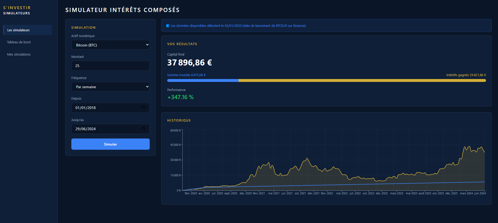

# 💰 Simulateur Crypto - S'investir

Simulateur d'investissement DCA (Dollar Cost Averaging) en cryptomonnaies, conçu pour s'intégrer à la suite d'outils S'investir.

🔗 **Démo en ligne** : [simulateur-crypto-sinvestir.vercel.app](https://simulateur-crypto-sinvestir.vercel.app)

## ✨ Fonctionnalités

- 📊 Simulation DCA (achat récurrent) ou investissement unique (one-shot)
- 🪙 10 cryptomonnaies populaires disponibles (Bitcoin, Ethereum, BNB, Solana...)
- 📈 Historique de prix réel via l'API Binance (depuis la date de lancement de chaque actif)
- 💶 Calcul automatique : capital investi, capital final, performance
- 📉 Graphique combiné valeur du portefeuille / montant investi
- ⚠️ Gestion des erreurs et messages informatifs (ex: période réelle de données disponible)
- 📱 Interface responsive (sidebar avec menu hamburger sur mobile)
- 🎨 Design fidèle à l'identité visuelle de simulateurs.sinvestir.fr

## 🛠️ Stack technique

- **Framework** : Next.js 16 (App Router)
- **Langage** : TypeScript
- **Styling** : Tailwind CSS v4
- **Graphiques** : Recharts
- **Données** : API publique Binance (historique de prix)
- **Tests** : Vitest
- **Déploiement** : Vercel
- **Analytics** : Vercel Web Analytics

## 🤔 Partis pris techniques

### Pourquoi Next.js plutôt que React + Vite ?

Cohérence avec la stack S'investir (Next.js, Supabase, Vercel mentionnés dans le brief). Permet aussi une intégration future facilitée (Server Components, API routes si besoin d'ajouter un backend léger).

### Pourquoi l'API Binance plutôt que CoinGecko ?

CoinGecko (suggérée initialement) limite l'historique gratuit à 365 jours. Le simulateur de référence couvre plusieurs années (2018-2026) : l'API publique Binance offre l'historique complet sans clé API, ce qui correspond mieux au besoin réel.

### Pourquoi limiter à 10 cryptomonnaies plutôt que 7000+ ?

Le simulateur de référence propose une sélection large, mais pour cette démo technique, une sélection des cryptos les plus populaires (toutes disponibles sur Binance) suffit à démontrer la logique fonctionnelle sans complexifier inutilement le composant de sélection.

### Pourquoi un seul graphique combiné plutôt que deux séparés ?

Le modèle de référence propose deux graphiques distincts (Historique + Gains/Pertes) avec sliders de zoom. Pour ce test technique au périmètre volontairement réduit, un graphique combiné (valeur + investi) communique l'essentiel de l'information de façon plus synthétique.

## 🚀 Lancer le projet en local

\`\`\`bash

# Cloner le repo

git clone https://github.com/ansenthandrayen/simulateur-crypto-sinvestir.git
cd simulateur-crypto-sinvestir

# Installer les dépendances

npm install

# Lancer le serveur de développement

npm run dev
\`\`\`

Aucune variable d'environnement nécessaire — l'API Binance publique ne nécessite pas de clé d'authentification.

## 🧪 Tests

\`\`\`bash
npm run test:run
\`\`\`

## 📂 Architecture

\`\`\`
src/
├── app/ # Pages Next.js (App Router)
├── components/ # Composants React réutilisables
├── data/ # Données statiques (liste des cryptomonnaies)
├── services/ # Logique métier (API Binance, calcul DCA)
└── tests/ # Tests unitaires
\`\`\`

## 🔌 Intégrabilité

Le composant est conçu pour être réutilisable et embarquable :

- Logique métier (`dcaCalculator.ts`) totalement découplée de l'UI
- Aucune dépendance à un état global ou contexte externe
- Composants React autonomes, facilement extractibles vers une librairie partagée

## 📝 Licence

Projet réalisé dans le cadre d'un test technique pour S'investir.
